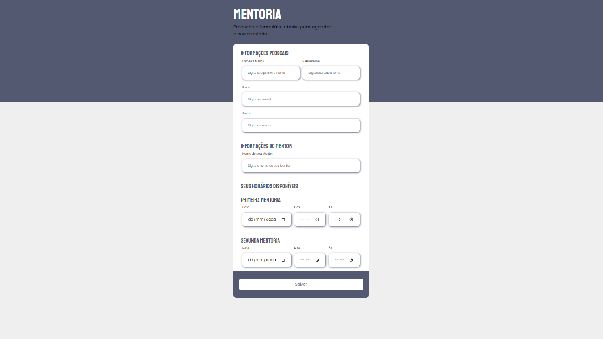

# Projeto Formulário Intermediário

## Descrição
    Projeto para treinamento de confecção de formulário tendo como inspiração um design do figma.

## Meu Processo

    •	Marcação semântica HTML5
    •	Propriedades personalizadas de CSS3
    •	Flexbox
    •	Figma
    

## Figma

Design Figma: <a href="https://www.figma.com/file/HDD3FCMwo8YPuDA1Yv970j/Stage-03---Formul%C3%A1rio-intermedi%C3%A1rio-(Copy)?node-id=0%3A1&t=JMI0dteKM4a0L1IB-0">Formulário</a>

## Design

### Desktop

## Autor

 GitHub: <a href="https://github.com/devkarine">DevKarine</a>  
FrontEndMentor: <a href="https://www.frontendmentor.io/profile/devkarine">@devkarine</a>  
CodePen: <a href="https://codepen.io/devkarine">DevKarine</a>  
LinkedIn: <a href="https://www.linkedin.com/in/devkarine/">Karine Pereira</a>